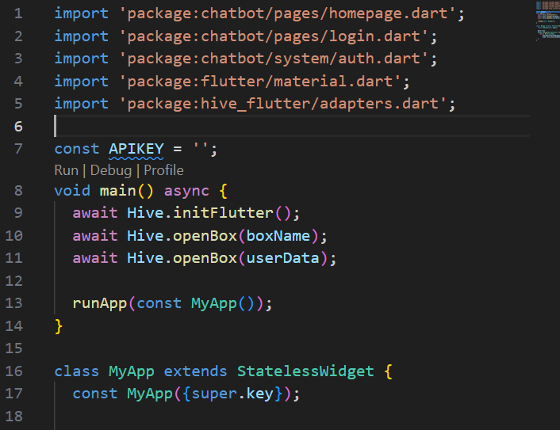
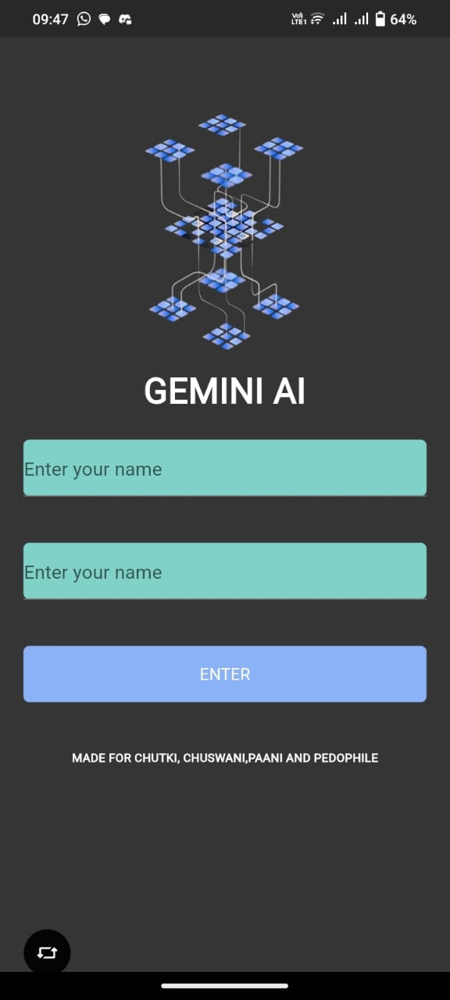
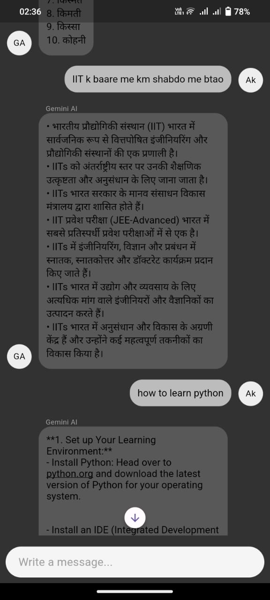

# Chatbot App using Gemini API

This Flutter application showcases a chatbot integration using the Gemini API.

## Overview

The app allows users to interact with a Gemini API-powered chatbot for various tasks, information retrieval, and handling queries.

 

## Features

- **Chat Interface:** Provides an intuitive chat interface for seamless communication with the chatbot.
- **Gemini API Integration:** Integrates effectively with the Gemini API for data retrieval and query responses.
- **Task Management:** Efficiently manages a range of user tasks through interactive chat interactions.
- **Customization:** Offers customization options for chat settings and preferences.

## Getting Started

Follow these steps to set up the app on your local machine:

1. **Clone the Repository:**
   ```bash
   git clone git@github.com:Achiket123/chatbot.git
2. **Navigate to the Project Directory:**
    ```bash 
    cd chatbot
3. **Install Dependencies:**
    ```bash
    flutter pub get
4. **Add Your Api Key here from Makersuite**
   
      

4. **Run the App:**
    ```bash
    flutter run
## SCREENSHOTS

    

## DOWNLOAD
-To download the app [click here](https://drive.google.com/file/d/19LQ47QHaFUkERJ1DPmgglKW6huU0lrDG/view?usp=drivesdk)

## CONTRIBUTIONS
Contributions are encouraged! If you encounter issues or have suggestions for enhancements, please feel free to open an issue or submit a pull request.

## LICENSE 
This project is licensed under the [MIT License](https://opensource.org/licenses/MIT).
